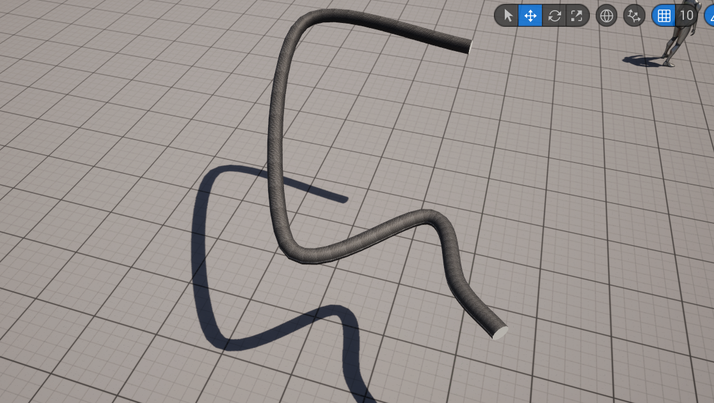
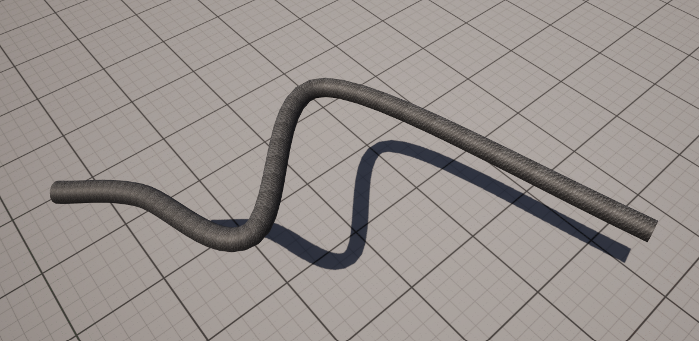

# Spline Extrusion Geometry using Catmull-Rom Splines in Unreal Engine

## Overview
This project demonstrates a spline extrusion geometry tool built in Unreal Engine 5 using C++. The tool generates a smooth geometry along a Catmull-Rom spline, with options for real-time control point manipulation and customizable extrusion width. The solution uses the `ProceduralMeshComponent` for mesh generation instead of `SplineMeshComponent`, providing full control over the mesh creation process.

## Features
- Smooth Catmull-Rom spline interpolation
- Real-time control point editing via Blueprint
- Geometry generation using `ProceduralMeshComponent`
- Texture mapping with dynamic material instance
- Runtime modifications for control points and extrusion width

## Inputs
1. List of Control Points from a text file
2. Texture file in PNG/JPEG format
3. Extrusion width

## Technical Implementation
### Blueprint Structure
A Blueprint class `BP_SplineExtrudeGeometryCreator` inherits from `ASplineExtrudeGeometryCreater` in C++ and is responsible for:
- Adding, removing, and modifying control points using the details panel
- Loading control points and textures from files
- Generating mesh geometry during construction and runtime

### C++ Class: ASplineExtrudeGeometryCreater
#### Header (.h) File
```cpp
#pragma once

#include "CoreMinimal.h"
#include "GameFramework/Actor.h"
#include "SplineExtrudeGeometryCreater.generated.h"

UCLASS()
class EXTRUDEGEOMETRY_API ASplineExtrudeGeometryCreater : public AActor
{
    GENERATED_BODY()

public:
    ASplineExtrudeGeometryCreater();
    virtual void Tick(float DeltaTime) override;

protected:
    virtual void BeginPlay() override;

private:
    float WidthOfExtrudeGeometry;
    TArray<FVector> SplinePoints;
    TArray<FVector> SplineTangents;

    UMaterialInterface* BaseMaterial;
    UTexture2D* LoadedTexture;

    void CreateSplinePointsFromControlPoints(const TArray<FVector>& controlPoints, int32 SegmentsPerPoint);
    void CreateExtrudeGeometrySegment(const TArray<FVector>& SplinePoints, int32 Index);

public:
    UPROPERTY(EditAnywhere, BlueprintReadWrite)
    class UProceduralMeshComponent* ProceduralMesh;

    UPROPERTY(EditAnywhere, BlueprintReadWrite)
    UMaterialInstanceDynamic* DynamicMaterial;

    UPROPERTY(EditAnywhere, BlueprintReadWrite, Category = "ExtrudeGeometry")
    int32 SidesPerSegment = 12;

    UPROPERTY(EditAnywhere, BlueprintReadWrite, Category = "ExtrudeGeometry")
    int32 SegmentsPerPoint = 100;

    UPROPERTY(EditAnywhere, BlueprintReadWrite, Category = "ExtrudeGeometry")
    TArray<FVector> ControlPoints;

    UFUNCTION(BlueprintCallable, Category = "ExtrudeGeometry")
    void SetExtrudeGeometryProperties(FString SplineControlPointsFilePath, FString TextureFilePath, float WidthOfExtrudeGeometry);

    UFUNCTION(BlueprintCallable, Category = "ExtrudeGeometry")
    void CreateExtrudeGeometry();

    UFUNCTION(BlueprintCallable, Category = "Update Geometry")
    void UpdateControlPoints(const TArray<FVector>& UpdatedControlPoints);

    UFUNCTION(BlueprintCallable, Category = "Update Geometry")
    void UpdateExtrudeGeometryWidth(float Width);
};
```

#### Source (.cpp) File
```cpp
#include "SplineExtrudeGeometryCreater.h"
#include "ProceduralMeshComponent.h"
#include "Materials/MaterialInstanceDynamic.h"
#include "Engine/Texture2D.h"

ASplineExtrudeGeometryCreater::ASplineExtrudeGeometryCreater()
{
    PrimaryActorTick.bCanEverTick = true;
    ProceduralMesh = CreateDefaultSubobject<UProceduralMeshComponent>(TEXT("ProceduralMesh"));
    RootComponent = ProceduralMesh;
}

void ASplineExtrudeGeometryCreater::BeginPlay()
{
    Super::BeginPlay();
    CreateExtrudeGeometry();
}

void ASplineExtrudeGeometryCreater::Tick(float DeltaTime)
{
    Super::Tick(DeltaTime);
}

void ASplineExtrudeGeometryCreater::CreateSplinePointsFromControlPoints(const TArray<FVector>& controlPoints, int32 SegmentsPerPoint)
{
    // Catmull-Rom Spline Interpolation Implementation
}

void ASplineExtrudeGeometryCreater::CreateExtrudeGeometrySegment(const TArray<FVector>& SplinePoints, int32 Index)
{
    // Mesh Generation Logic
}
```

## Output
Link to [Output Video.](https://drive.google.com/file/d/1DKkenS8IG10yuMAXV8WY8eOZli3UV5kk/view?usp=sharing)





